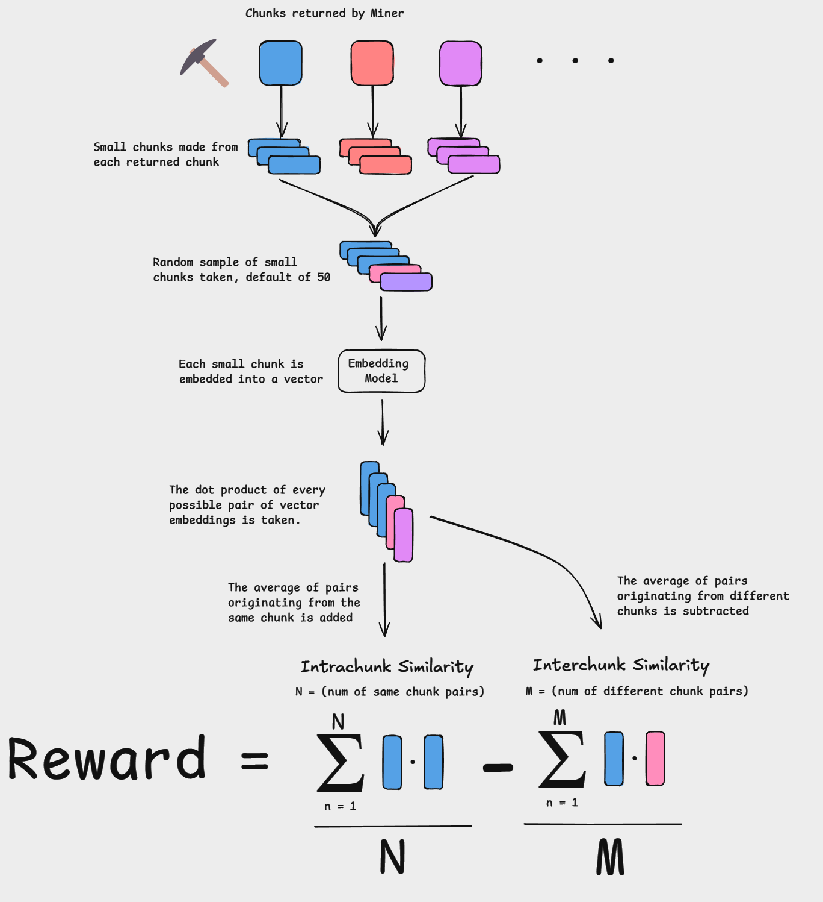

# **Chunking Subnet on Bittensor** <!-- omit in toc -->

 

---

## Leading the way for better NLP <!-- omit in toc -->

[Discord](https://discord.gg/bittensor) • [Network](https://taostats.io/) • [Research](https://bittensor.com/whitepaper)

## Introduction

In the rapidly advancing world of conversational artificial intelligence, one of the most fundamental challenges remains implementing long-term memory into AI systems both effectively and efficiently.

**Mission** 

Our mission is to address a critical aspect of preprocessing data when using vector database solutions: chunking. By refining and optimizing chunking techniques, we aim to enhance the efficiency and effectiveness of Retrieval-Augmented Generation (RAG) systems. Our ultimate goal is to improve machine learning models and algorithms, contributing to a better global solution for data retrieval and processing, with a vision to expand and handle other key aspects of RAG in the future. To better understand our intentions, please read our medium article.

**What is Chunking?** 

Chunking is the process of breaking down a large text or a set of data into smaller, more manageable chunks. This technique is essential in natural language processing (NLP) and particularly useful when working with large language models (LLMs). Chunking can involve various methods of segmentation, such as splitting an article into sections, a book into chapters, or a screenplay into scenes.

**Why Chunk?** 

To understand why chunking is necessary, let us first discuss how long-term memory is currently implemented in many AI systems. When working with LLMs that need to access a vast base of knowledge, it is impractical to pass the entire corpus of data with each request due to the high cost of inference. For example, querying an LLM using a book as a source can be quite costly. Even at a rate of $5.00 per million tokens, querying a 500-page book, which is estimated to be around 200,000 tokens, would cost approximately $1.00 per query. This high expense makes the integration of specialized characters or the inclusion of extensive knowledge from numerous texts impractical.

To address this issue, we utilize chunking. By breaking down large texts into smaller, manageable chunks and transforming these chunks into vectors with embedded meanings, we store them in a vector database. When a user sends a query, we embed the query as a vector and identify the vectors in the database with meanings most related to the query. Instead of loading the entire book into the model’s context, we only retrieve the relevant chunks of text, significantly reducing the total number of tokens processed per query.

Chunking, therefore, enables efficient and cost-effective querying by focusing on relevant portions of text, maintaining the balance between comprehensive knowledge and resource management.

Chunking is an important preliminary step for many machine learning (ML) tasks that use large amounts of data, such as:
- Retrieval-Augmented Generation (RAG): Rag utilizes a database of relevant documents to give LLMs the proper context to parse a particular query. Effective chunking results in more relevant and specific texts being included in the LLM’s context window, leading to better responses

- Classification: Chunking can be used to separate texts into similar sections, which can be then classified and assigned labels. This enhances the accuracy and efficiency of classification tasks

- Semantic Search: Improved chunking can enhance the accuracy and reliability of semantic searching algorithms, which return results based on the similarity in semantic meaning rather than simple keyword matching

## Getting Started

- Review min compute requirements for desired role

- Ensure you've gone through the [checklist for validating and mining](https://docs.bittensor.com/subnets/checklist-for-validating-mining)

### Computation Requirements
- To run a validator, there are no specific computation requirements as all major computer architectures are optimized for vector operations. We recommend you run the test_compute_requirements script to get a recommendation for the number of embeddings you should compute for each miner evaluation.

- To run a miner, again there are no specific computation requirements as the amount of compute is entirely dependent on the code you are running. The default miner we provide should run on any hardware.

### Installation

#### Validating

Please see [Validator Setup](./docs/validator_setup.md) to learn how to set up a validator

#### Miner

Please see [Miner Setup](./docs/miner_setup.md) to learn how to set up a miner

## Scoring

As described in more detail in the validator and mining setup documentation, validators need to consider the number of embeddings they will generate while evaluating a miner. When scoring, a random-sample of 3-sentence segments are taken from the response and are embedded. The dot product of every possible pair of these embeddings is then compared and added to the final score. If the embeddings originated from the same chunk, it is added to the final score–if the embeddings originated from different chunks, it is subtracted from the final score.

Here is a visualization of how the validator calculates the miner’s score:

A greater sample size will likely result in more accurate evaluations and higher yields. This will come at the cost of more API calls to generate the additional embeddings and potentially more time and resources comparing them against each other. 

Miners should create their own logic and improve on what is initially provided in neurons/miner.forward to achieve better results when chunking (more information is provided in [Miner Setup](./docs/miner_setup.md))

## Resources

For miners, there are various approaches to chunking that can produce high-quality chunks. We recommend that you use recursive or semantic chunking, but in line with Bittensor’s ideology, we invite you to experiment. To learn more about the basics of chunking, we recommend you read through this [article](https://www.pinecone.io/learn/chunking-strategies/). Additional resources are provided in the [Miner Setup](./docs/miner_setup.md) documentation.

