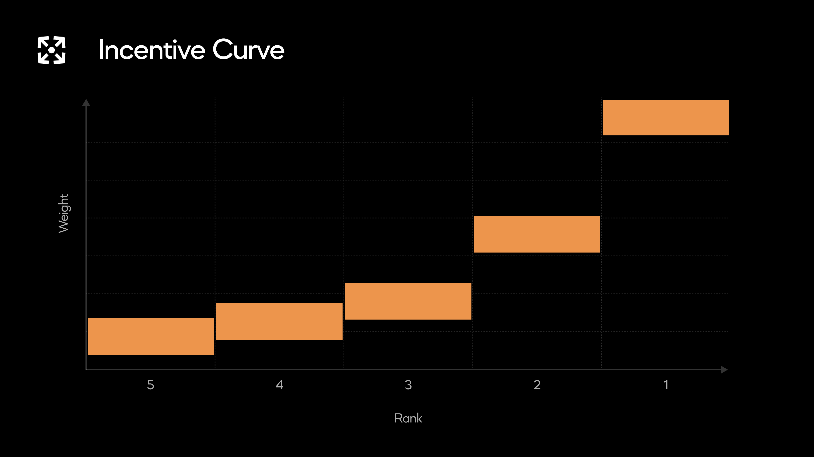

# Incentive Mechanism

This subnet incentivizes responses that maximize intrachunk similarity and interchunk dissimilarity, without exceeding variable constraints, such as time or maximum chunk length.

The possible range of scores is heavily dependent on the given document. For example, a document consisting only of the letter 'a' repeating thousands of times would trivialize all intrachunk similarity to '1' and all interchunk dissimilarity to '0.' Conversely, if a document consisted of the random string, it would be impossibly hard to find any similarity.

While those are extreme examples, all documents vary in degree of similarity and dissimilarity. Therefore, in order to control for the document, responses of miners are compared relatively—between all miners who were asked the same question. As a result, any given query can only change the ranks of miners within the queried group.

# Group Tournament Ranking

This subnet uses a form of Group Tournament Ranking to control for the confounding effects of the input document. All validators maintain their own internal ranking of miners, from which they create groups and set weights.

## 1. Forming Groups

### Synthetic Queries
For synthetic queries, validators start by creating groups of miners with adjacent ranks. If there are less than 20 miners, only one group is made. Otherwise, each group consists of 20 miners. Groups are overlapping, with miners appearing in up to two groups. From [forward.py](../chunking/validator/forward.py):

```python
def get_miner_groups(self: Validator) -> tuple[np.ndarray, np.ndarray, int]:
    bt.logging.debug(f"rankings: {self.rankings}, sample_size: {self.sample_size}")
    group_size = min(len(self.rankings), self.sample_size)    
    bt.logging.debug(f"group_size {group_size}")    
    group_ranks = []
    miner_groups: list[np.array] = []

    start = 0
    stop = len(self.rankings) - group_size + 1
    step = floor(group_size / 2)
    
    bt.logging.debug(f"start: {start}, stop: {stop}, step: {step}")
    
    for i in range(start, stop, step):
        group_ranks.append(range(i, i+group_size))
        miner_groups.append(np.array(self.rankings[group_ranks[-1]], dtype=int))
    return (miner_groups, group_ranks, group_size)
```

From there, a random group is selected. This is the group of miners that will be given the synthetic query.

```python
if task.miner_uids is None or not found_match:
        miner_group = choice(range(len(miner_groups)))
```

### Organic Queries

> [!NOTE] Organic queries are still in development.

For organic queries, validators specify a list of miners from which to query. From [forward.py](../chunking/validator/task_api.py):

```python
if task["task_id"] != -1:
    task_id = task["task_id"]
    miner_uids = task.get('miner_uids')
```

As organic data is of higher quality than synthetic data, validators still aim to query at least 20 miners. If a miner is specified by the origin source (i.e., Chunking.com), the validator queries a group of 20 miners of adjacent rank while ensuring that the miner specified is in that group.

## 2. Evaluating

The document is then sent to all miners in the selected group, alongside the constraints of maximum `chunk_size` and `soft_time_max`. The responses are then scored as described in [Evaluation](./evaluation.md).

## 3. Ranking

Miners are first ranked within their group based on their performance. From [reward.py](../chunking/validator/reward.py):
```python
def rank_responses(
        rewards: np.ndarray,
) -> np.ndarray:
    """
    Returns an array containing the ranks of the responses using their rewards. Higher reward is better.

    Args:
    - rewards (List[float]): The list of rewards that were calculated.

    Returns:
    - np.ndarray: 
    """

    response_ranks = np.zeros_like(rewards)

    rank = 0
    for _ in range(len(rewards)):
        next_best_index = rewards.argmax()
        
        if rewards[next_best_index] == 0:
            # should not be ranked
            response_ranks[next_best_index] = -1
        else:
            response_ranks[next_best_index] = rank
            rank += 1
            
        rewards[next_best_index] = -np.inf
    return response_ranks
```

These ranks are then used to update the global internal ranking of the validator. Ranks are a weighted average. From [validator.py](../neurons/validator.py):

```python
def update_scores(self, ranks: np.ndarray, uids: List[int]):
        """Performs exponential moving average on the scores based on the rewards received from the miners."""

        # Check if rewards contains NaN values.
        if np.isnan(ranks).any():
            bt.logging.warning(f"NaN values detected in rewards: {ranks}")
            # Replace any NaN values in rewards with inf.
            ranks = np.nan_to_num(ranks, nan=np.inf)

        if isinstance(uids, np.ndarray):
            uids_array = uids.copy()
        else:
            uids_array = np.array(uids)

        # Update scores with rewards produced by this step.
        alpha: float = self.config.neuron.moving_average_alpha

        temp_scores = np.copy(self.scores)  
        
        bt.logging.debug(f"Previous scores: {self.scores}, ranks: {ranks}, uids: {uids_array}")            
        
        for rank, uid in zip(ranks, uids_array):
            if np.isinf(rank):
                continue
            
            # Example

            # uids: [0, 1, 2]
            # ranked: [0, 2, 1] local
            
            # Previous
            # [0.36675003 1.6840354  0.48990285 2.5501432  2.0185351, inf, inf]
            
            # Moving Avg
            # [0.31173754 1.5814301  0.71641743 2.5501432  2.0185351, inf, inf]
            
            # [0 2 1 4 3 5 6] global
            
            # initialize score if it is np.inf
            if np.isinf(temp_scores[uid]):
                temp_scores[uid] = alpha * rank
            else:            
                temp_scores[uid] = alpha * rank + (1 - alpha) * temp_scores[uid]                
         
        self.scores = temp_scores
         
        bt.logging.debug(f"Updated moving avg scores: {self.scores}")                
        
        self.rankings = np.argsort(self.scores)
                        
        bt.logging.debug(f"Updated rankings: {self.rankings}")
```

## Example
Here is an example of this system with 12 miners and a sample size of 4:


# Incentive Curve
When setting weights, the weight of the nth-best ranked miner will be twice that of the weight of the (n+1)th ranked miner, or (1/2)^n. From `set_weights(self: "BaseValidatorNeuron")` in [validator.py](../neurons/validator.py):
```python
# Calculate weights
n = len(self.scores)
raw_weights = np.zeros(n)    
i = 0    
for uid in sorted_uids:
    if np.isinf(self.scores[uid]):
        continue
    raw_weights[uid] = (1/2) ** i  # (1/2)^i where i is the rank (0-indexed)            
    i += 1
```

Here is an example of the incentive curve with 5 miners:

