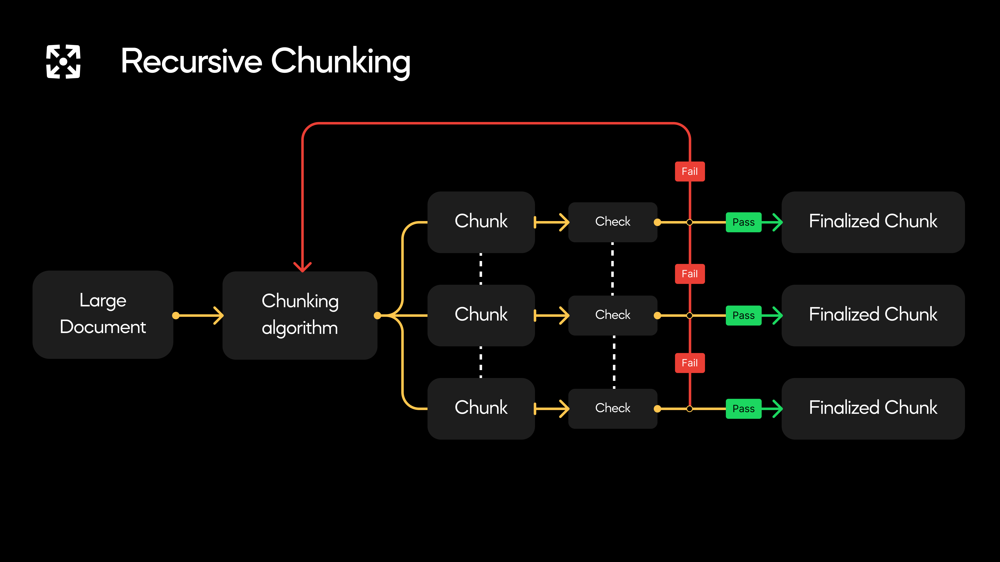
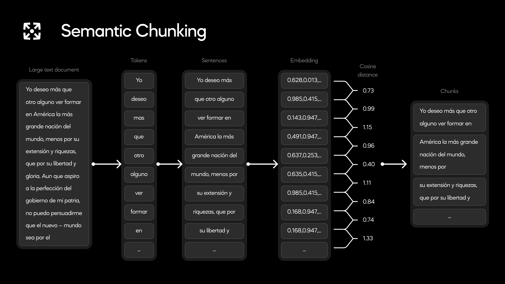

# Prerequisites
- Review the minimum computational requirements for the desired role

- Ensure you have gone through the [checklist for validating and mining](https://docs.bittensor.com/subnets/checklist-for-validating-mining)

- Ensure that you have registered a hotkey for our subnet


# Installation

This repository requires python3.8 or higher. To install, simply clone this repository and install the requirements.
```bash
git clone https://github.com/VectorChat/chunking_subnet
cd chunking_subnet
python -m pip install -r requirements.txt
python -m pip install -e .
```

It is highly recomended that you write your own logic for neurons/miner.py:forward to optimize chunking and maximize rewards. For guidance creating a custom miner, please refer to the [Custom Miner](#custom-miner) section.

To run the miner, issue the following command:
```bash
python3 neurons/miner.py --netuid $uid --wallet.name <COLDKEY> --wallet.hotkey <HOTKEY> --log_level debug
```

# Default Miner
The default miner simply splits the incoming document into individual sentences and then forms each chunk by concatenating adjacent sentences until the token limit specified by the validator is reached. This is not an optimal strategy and will likely result in lower yields or deregistration. For help on writing a custom miner, see [Custom Miner](#custom-miner).


# Custom Miner

To change the behavior of the default miner, edit the logic in neurons/miner.py:forward to your liking.

## Considerations

Validators check each chunk that is sent to them against the source document that they sent out. To ensure that your chunks match the source document, it is highly encouraged that you use NLTK's sentence_tokenizer to split the document by sentences before combining them into chunks.

Each incoming query contains a variable called tokensPerChunk. Exceeding this number of tokens in any of your chunks results in exponentially severe reductions to your score, so ensure that your logic does not produce chunks that exceed that number of tokens.

Chunk quality is calculated based on the semantic similarity within a given chunk and its dissimilarity to other chunks. In order to produce the best chunks, ensure that all text in a chunk is related and that text from different chunks are not.

### Chunking Strategies
There are various approaches to chunking that can produce high-quality chunks. We recommend that you use recursive or semantic chunking, but there are possibly better strategies. To learn more about chunking, we recommend you read this [Pinecone article](https://www.pinecone.io/learn/chunking-strategies/).

#### Recursive Chunking

Recursive chunking begins by splitting the data set into a small number of chunks. It then checks whether each chunk meets the desired criteria (such as size or semantic self-similarity.) If a chunk does not meet these criteria, the algorithm recursively splits that chunk into smaller chunks. This process continues until all chunks satisfy the specified criteria. 

Here is a diagram of this process:



#### Semantic Chunking

Semantic chunking starts by splitting the entire data set into individual sentences. Each sentence, called an anchor sentence, is then grouped with a number of surrounding sentences to form a sentence group. These sentence groups are compared sequentially. A chunk boundary is established wherever the semantic difference between adjacent sentence groups crosses some threshold.

Here is an example with a threshold of 1:



#### Prebuilt Solutions

There exist many freely available chunking utilities that can help you get a head start on your chunking algorithm, see the following links:
[Pinecone's Respository](https://github.com/pinecone-io/examples/tree/master/learn/generation/better-rag)
[LangChain Text Splitting Documentation](https://js.langchain.com/v0.1/docs/modules/data_connection/document_transformers/)